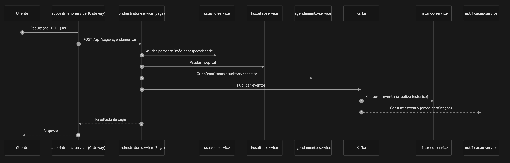
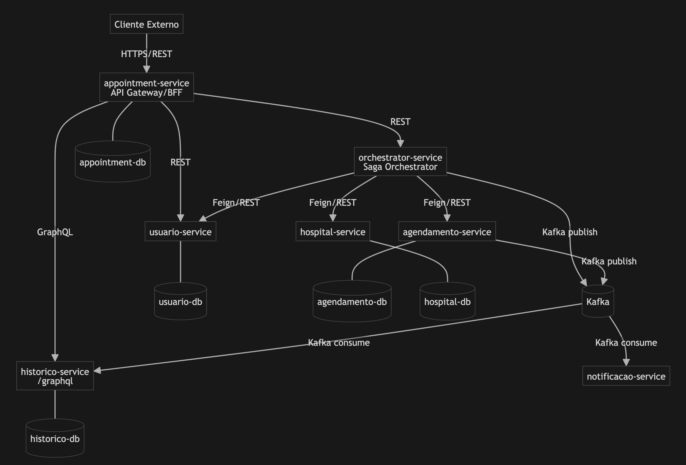

# Tech Challenge FIAP - Backend Hospital

Sistema de gerenciamento hospitalar desenvolvido com arquitetura de microserviços.

## Links úteis
- Github: https://github.com/FiapPos/tech-challenge-fiap-backend-hospital
- Collection do Postman: [Prioridade Consultas - Agendamento Service.postman_collection.json](agendamento-service/postman/Prioridade%20Consultas%20-%20Agendamento%20Service.postman_collection.json) e [Prioridade-Consultas.postman_environment.json](agendamento-service/postman/Prioridade-Consultas.postman_environment.json)
- Simulação de fluxo completo de notificação e redirecionamento entre dois usuários distintos: https://drive.google.com/file/d/1R95HxQT4EiCdeuIBXSGy-Ys0IjMCwddJ/view?usp=sharing


## Equipe
- [Gustavo Lima - RM363714](https://github.com/GustavoLimaAl)
- [Isabella Cruz - RM363205](https://github.com/isabellacoliveira)
- [Karolyne de Carvalho- RM363153](https://github.com/KarolyneFerreira)
- [Sonia Ribeiro - RM364992](https://github.com/hopesoh)
- [Stephanie Menezes - RM361828](https://github.com/steingcam)

## Execução
```
export TELEGRAM_BOT_TOKEN="SEU_TOKEN_AQUI"
docker-compose up --build
```

## 🏗️ **ARQUITETURA**

Este backend foi construído em **arquitetura de microserviços**, com comunicação **síncrona (HTTP/REST + GraphQL)** e **assíncrona (Kafka)**. O fluxo de agendamento usa **Saga Pattern (orquestrada)** para garantir consistência entre serviços.

### Visão geral (alto nível)

- **Entrada única (BFF/API Gateway)**: `appointment-service`
- **Orquestração de transações distribuídas (Saga Orchestrator)**: `orchestrator-service`
- **Serviços de domínio**: `usuario-service`, `agendamento-service`, `hospital-service`, `historico-service`, `notificacao-service`
- **Banco por serviço** (quando aplicável): PostgreSQL (containers dedicados no `docker-compose.yml`)
- **Mensageria**: Kafka (com Zookeeper + Redpanda Console)

### Microserviços e responsabilidades

- **`appointment-service` (API Gateway / BFF)**
  - Ponto único de entrada para clientes externos
  - **Autenticação/Autorização (JWT)** e roteamento para serviços internos
  - Proxy **REST** (ex.: auth/agendamentos) e **GraphQL** (histórico)

- **`orchestrator-service` (Saga Orchestrator)**
  - Centraliza a lógica de **Saga** (criação/edição/cancelamento de agendamentos)
  - Comunicação síncrona via **OpenFeign** com serviços de domínio
  - Publica/consome eventos via **Kafka**
  - **Stateless** (não persiste dados)

- **`usuario-service`**
  - Cadastro e ciclo de vida de usuários, perfis, especialidades, endereços
  - Endpoint de **login** e emissão/validação de **JWT**
  - Persistência: PostgreSQL + migrations (Flyway)

- **`agendamento-service`**
  - Registro/atualização/confirmação/cancelamento de consultas + **fila de espera**
  - Integração com **Kafka** (ex.: `notificacao-sucesso`, `historico-sucesso`, `consultas`)
  - Possui schedulers (ex.: confirmação de consulta via Telegram)
  - Persistência: PostgreSQL

- **`hospital-service`**
  - CRUD de hospitais
  - Persistência: PostgreSQL

- **`historico-service`**
  - Histórico médico via **API GraphQL** (`/graphql`) + GraphiQL (`/graphiql`)
  - Consome eventos Kafka para manter histórico atualizado
  - Persistência: PostgreSQL

- **`notificacao-service`**
  - Consumer Kafka responsável por enviar notificações (criação/edição/cancelamento)
  - Implementa **Strategy Pattern** para tipos de notificação
  - **Stateless** (não persiste dados)

### Comunicação entre serviços

- **Síncrona (HTTP)**
  - `appointment-service` → (REST) `usuario-service` / `orchestrator-service`
  - `orchestrator-service` → (Feign/REST) `usuario-service`, `agendamento-service`, `hospital-service`
  - `appointment-service` → (GraphQL) `historico-service`

- **Assíncrona (Kafka)**
  - Serviços publicam eventos de consulta/agendamento
  - `historico-service` e `notificacao-service` reagem a eventos para registrar histórico e notificar pacientes

### Fluxo principal (Saga de Agendamento – orquestrada)

1. Cliente chama o **API Gateway** (`appointment-service`)
2. Gateway valida **JWT** e encaminha para o **orchestrator-service**
3. Orquestrador valida entidades (usuário/médico/especialidade/hospital)
4. Orquestrador cria/atualiza/cancela agendamento no `agendamento-service`
5. Eventos são publicados no **Kafka** para histórico/notificação
6. `historico-service` atualiza histórico e `notificacao-service` dispara notificações

### Tecnologias (stack do repositório)

- **Java**: 21
- **Framework**: Spring Boot 3.5.5 (+ Spring Cloud 2025.0.0)
- **Persistência**: Spring Data JPA / Hibernate + PostgreSQL (Compose usa `postgres:16-alpine`)
- **Mensageria**: Apache Kafka (Compose usa imagens Confluent 7.6.0) + Redpanda Console
- **Segurança**: JWT (Spring Security)

> Observação: portas e URLs de acesso estão documentadas no `README.md` raiz (host vs. interno Docker).





### Portas
#### 🌐 ACESSANDO DE FORA DO DOCKER (Navegador, Postman, curl)
```
┌─────────────────────────┬──────────────────────────────────────┐
│ Serviço                 │ URL Correta                          │
├─────────────────────────┼──────────────────────────────────────┤
│ usuario-service         │ http://localhost:3001                │
│ agendamento-service     │ http://localhost:3002                │
│ historico-service       │ http://localhost:3003                │
│ notificacao-service     │ http://localhost:3004                │
│ appointment-service     │ http://localhost:3005                │
│ hospital-service        │ http://localhost:3006                │
│ orchestrator-service    │ http://localhost:8080                │
│ redpanda-console        │ http://localhost:8081                │
└─────────────────────────┴──────────────────────────────────────┘
```

#### 🐳 ACESSANDO DE DENTRO DO DOCKER (Container → Container)
```
┌─────────────────────────┬──────────────────────────────────────┐
│ Serviço                 │ URL Correta                          │
├─────────────────────────┼──────────────────────────────────────┤
│ usuario-service         │ http://usuario-service:3000          │
│ agendamento-service     │ http://agendamento-service:3000      │
│ historico-service       │ http://historico-service:3003        │
│ notificacao-service     │ http://notificacao-service:3000      │
│ appointment-service     │ http://appointment-service:3002      │
│ hospital-service        │ http://hospital-service:3000         │
│ orchestrator-service    │ http://orchestrator-service:8080     │
└─────────────────────────┴──────────────────────────────────────┘
```

#### 🗄️ BANCOS DE DADOS (Acesso Externo - pgAdmin, DBeaver)
```
┌─────────────────────────┬──────────────────────────────────────┐
│ Banco de Dados          │ Conexão                              │
├─────────────────────────┼──────────────────────────────────────┤
│ appointment-db          │ localhost:5432                       │
│ usuario-db              │ localhost:5433                       │
│ agendamento-db          │ localhost:5434                       │
│ historico-db            │ localhost:5435                       │
│ hospital-db             │ localhost:5436                       │
└─────────────────────────┴──────────────────────────────────────┘
```

#### 📡 INFRAESTRUTURA
```
┌─────────────────────────┬──────────────────────────────────────┐
│ Serviço                 │ URL/Porta                            │
├─────────────────────────┼──────────────────────────────────────┤
│ Kafka (externo)         │ localhost:9092                       │
│ Kafka (interno)         │ kafka:29092                          │
│ Zookeeper               │ localhost:2181                       │
│ Redpanda Console        │ http://localhost:8081                │
└─────────────────────────┴──────────────────────────────────────┘
```

### Documentações
- **agendamento-service**
  - [Documentação](agendamento-service/README.md)
- **appointment-service**
  - [Documentação](appointment-service/README.md)
  - [Documentação do postman](appointment-service/README-POSTMAN.md)
- **historico-service**
  - [Documentação](historico-service/README.md)
  - [Guia de testes](historico-service/GUIA_TESTES_GRAPHQL.md)
- **hospital-service**
  - [Documentação](hospital-service/README.md)
- **notificacao-service**
  - [Documentação](notificacao-service/README.md)
- **orchestrator-service**
  - [Documentação](orchestrator-service/README.md)
- **usuario-service**
  - [Documentação](usuario-service/README.md)
  - [Informações para o postman](usuario-service/postman)

---
