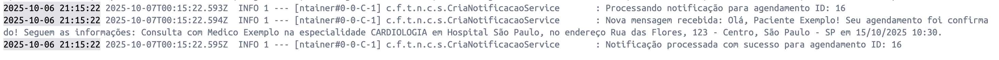

# Notificação Service

Serviço responsável por enviar lembretes e notificações automáticas aos pacientes sobre suas consultas (criação, alteração ou cancelamento).

## 🔌 Portas

| Contexto | URL Base | Porta Interna (Spring) | Observação |
|----------|----------|------------------------|------------|
| Docker Compose | http://localhost:3004 | 3000 | Mapeamento `3004:3000` (ver `docker-compose.yml`) |
| Execução local (mvn spring-boot:run) | http://localhost:3000 | 3000 | Acesso direto sem container |

> **Nota**: Este serviço não expõe endpoints REST públicos. Ele funciona como um consumer Kafka que processa eventos de forma assíncrona.

## 📚 Funcionalidades

Este serviço **não possui API REST**. Ele opera exclusivamente através de eventos Kafka:

### 📨 Tipos de Notificação

| Tipo | Descrição | Trigger |
|------|-----------|---------|
| **Criação** | Notifica paciente sobre nova consulta agendada | Evento de consulta criada |
| **Atualização** | Notifica paciente sobre alteração na consulta | Evento de consulta atualizada |
| **Cancelamento** | Notifica paciente sobre cancelamento da consulta | Evento de consulta cancelada |

### 🎯 Estratégias de Notificação

O serviço utiliza o **Strategy Pattern** para processar diferentes tipos de notificações:

- `NotificacaoCriacaoStrategy` - Processa notificações de novas consultas
- `NotificacaoEdicaoStrategy` - Processa notificações de alterações
- `NotificacaoCancelamentoStrategy` - Processa notificações de cancelamentos

## ⚙️ Execução

### Via Docker Compose (recomendado)
```bash
docker-compose up -d notificacao-service kafka zookeeper
```
Serviço disponível em: http://localhost:3004 (health check)

### Local sem Docker
```bash
cd notificacao-service
./mvnw spring-boot:run
# Windows PowerShell
# .\mvnw.cmd spring-boot:run
```
Serviço disponível em: http://localhost:3000 (health check)

## 🧪 Testes

### Executar testes unitários
```bash
cd notificacao-service
./mvnw test
```

### Testar processamento de eventos
Para testar o serviço, é necessário publicar eventos no tópico Kafka `notificacao-sucesso`:

```bash
# Exemplo de payload para teste
{
  "agendamentoId": "123",
  "pacienteId": "456",
  "hospitalId": "789",
  "medicoId": "101",
  "nomePaciente": "João Silva",
  "nomeMedico": "Dr. Carlos Santos",
  "nomeHospital": "Hospital São Paulo",
  "enderecoHospital": "Rua Exemplo, 123",
  "especializacao": "Cardiologia",
  "statusAgendamento": "CRIADA",
  "dataHoraAgendamento": "2024-12-15T14:30:00"
}
```

- Exemplo de notificação



## 🗃️ Banco de Dados
- **Nenhum** - Serviço stateless, não persiste dados
- Processa eventos e envia notificações de forma assíncrona

## 📦 Dependências principais
- Spring Boot 3
- Spring Kafka (consumer)
- Spring Actuator (health checks)
- Lombok
- Jakarta Validation

## 🧩 Estrutura (alto nível)
```
core/
  consumer/ (Kafka consumers)
  service/ (lógica de processamento)
  strategy/ (estratégias de notificação)
    NotificacaoStrategy (interface)
    NotificacaoCriacaoStrategy
    NotificacaoEdicaoStrategy
    NotificacaoCancelamentoStrategy
  dto/ (Data Transfer Objects)
  enums/ (enumerações)
configuration/
  kafka/KafkaConfig
```

## 🔄 Integração Kafka

O serviço consome eventos do Kafka para enviar notificações:

- **Topic consumido**: `notificacao-sucesso`
- **Consumer Group**: `notificacao-group`
- **Configuração**: Manual acknowledgment (garante processamento confiável)

### Fluxo de Processamento

1. **Recebe evento** do tópico `notificacao-sucesso`
2. **Seleciona estratégia** apropriada baseada no status do agendamento
3. **Processa notificação** usando a estratégia selecionada
4. **Envia notificação** ao paciente (email, SMS, push, etc.)
5. **Confirma processamento** (acknowledgment)

## 🎨 Design Patterns

### Strategy Pattern
Permite selecionar dinamicamente o algoritmo de notificação baseado no tipo de evento:

```
DadosAgendamento → CriaNotificacaoService → NotificacaoStrategy
                                              ├── CriacaoStrategy
                                              ├── EdicaoStrategy
                                              └── CancelamentoStrategy
```

**Benefícios:**
- ✅ Fácil adição de novos tipos de notificação
- ✅ Código desacoplado e testável
- ✅ Responsabilidade única para cada estratégia

## 📊 Monitoramento

### Health Check
```bash
# Docker
curl http://localhost:3004/actuator/health

# Local
curl http://localhost:3000/actuator/health
```

### Logs
Os logs incluem:
- Recebimento de eventos Kafka
- Seleção de estratégia
- Processamento de notificações
- Erros e exceções

```bash
# Visualizar logs do container
docker logs -f notificacao-service
```

## 🔐 Segurança
Atualmente sem autenticação (consome eventos internos). Camada preparada para futura implementação de segurança no Kafka (SASL/SSL).

## 🧭 Próximos Melhorias Sugeridas
- Integrar com provedores reais de notificação (email/SMS)
- Implementar retry policy para falhas no envio
- Adicionar Dead Letter Queue (DLQ) para eventos com falha
- Implementar template engine para mensagens personalizadas
- Adicionar métricas de notificações enviadas
- Implementar rate limiting para evitar spam
- Adicionar suporte a múltiplos canais (email, SMS, push, WhatsApp)
- Criar dashboard de monitoramento de notificações
- Implementar histórico de notificações enviadas

---
> Referência cruzada: documentação global do projeto no README raiz.

